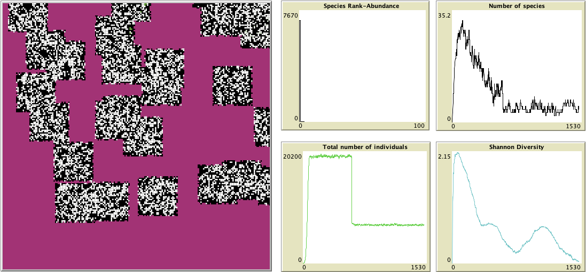

---
geometry:
 - vmargin=1in
 - hmargin=.6in

output:
  pdf_document: 
    includes:
      in_header: Appendices.sty
---
# Appendices - Supplementary Information

\small

------------------------------------------------------------------------------------------------------------
Model          Habitat        Habitat      Dispersal   Population   Population   Species   Species   Figure 
Version        Loss           Patch Size   Distance    Before       Final        Before    Final 
-------------- -------------  -----------  ----------  -----------  -----------  --------  --------  -------
Neutral        RandomBlock    3            3           19200        2500         32        14        S9

Neutral        RandomBlock    3            1.5         15300        1560         31        19        S10

Neutral        RandomBlock    29           3           19300        7000         26        13        S11

Neutral        RandomBlock    29           1.5         17400        6900         38        21        S12

Neutral        Regular        3            3           19500        20           27        4         S13

Neutral        Regular        3            1.5         15400        10           39        2         S14

Neutral        Regular        29           3           19100        6800         26        15        S15

Neutral        Regular        29           1.5         15200        6500         37        25        S16

Hierarchical   RandomBlock    3            3           19000        2300         24        9         S17

Hierarchical   RandomBlock    3            1.5         14000        1200         34        16        S18

Hierarchical   RandomBlock    29           3           19300        6800         27        3         S19

Hierarchical   RandomBlock    29           1.5         14000        6800         38        14        S20

Hierarchical   Regular        3            3           19200        10           32        4         S21

Hierarchical   Regular        3            1.5         15600        30           37        6         S22

Hierarchical   Regular        29           3           19200        6500         24        4         S23

Hierarchical   Regular        29           1.5         15500        6800         33        13        S24

Selection      RandomBlock    3            3           36900        14500        18        14        S25

Selection      RandomBlock    3            1.5         35500        13300        26        22        S26

Selection      RandomBlock    29           3           36900        14700        14        10        S27

Selection      RandomBlock    29           1.5         35200        14300        23        16        S28

Selection      Regular        3            3           36900        14200        20        11        S29

Selection      Regular        3            1.5         35400        13000        25        18        S30

Selection      Regular        29           3           37200        14800        19        11        S31

Selection      Regular        29           1.5         35200        14200        19        13        S32
------------------------------------------------------------------------------------------------------------

Table: Examples of simulations for all the versions of the model and all habitat loss patterns, with a 2 values of parameters for habitat patch size, and dispersal Distance, with $\lambda=2$ 

\normalsize

<!-- No selection RandomBlock -->

![Relationship between number of species and maximum patch size for varying dispersal distances and growth rate parameters  (across panels). Simulations were performed using a neutral model with a constant migration rate (0.0001). Following 200 time steps of the model, 60% of the habitat was destroyed, rendering it unavailable for the species. Habitat blocks of the same size (habitat patch size) were randomly distributed over the simulation grid. As a result, some patches overlapped, leading to a distribution of patch sizes. The range of patch sizes was determined by the habitat patch size parameter, defining the minimum and maximum sizes observed.](Figures/Species_MaxPatch_Dispersal_Lambda_block.png)

![Relationship between Shannon Diversity and maximum patch size for varying dispersal distances and growth rate parameters (across panels). Simulations were performed using a neutral model with a constant migration rate (0.0001). Following 200 time steps of the model, 60% of the habitat was destroyed, rendering it unavailable for the species. Habitat blocks of the same size (habitat patch size) were randomly distributed over the simulation grid. As a result, some patches overlapped, leading to a distribution of patch sizes. The range of patch sizes was determined by the habitat patch size parameter, defining the minimum and maximum sizes observed.](Figures/Shannon_MaxPatch_Dispersal_Lambda_block.png)

<!-- Hierarchical regular -->
![Relationship between number of species and habitat patch size for varying dispersal distances and growth rate parameters  (across panels). Simulations were performed using a competitive hierarchical model with constant migration and a replacement rate of 0.0001 and 0.3 respectively. Following 200 time steps of the model, 60% of the habitat was destroyed, rendering it unavailable for the species. The destruction of habitat resulted in the formation of regular patterns, where all remaining patches exhibited equal sizes.](Figures/Hierarchical_Species_Dispersal_Lambda_regular.png)

![Relationship between Shannon Diversity and habitat patch size for varying dispersal distances and growth rate parameters  (across panels). Simulations were performed using a competitive hierarchical model with constant migration and a replacement rate of 0.0001 and 0.3 respectively. Following 200 time steps of the model, 60% of the habitat was destroyed, rendering it unavailable for the species. The destruction of habitat resulted in the formation of regular patterns, where all remaining patches exhibited equal sizes.](Figures/Hierarchical_Shannon_Dispersal_Lambda_regular.png)

<!-- Selection regular --> 
![Relationship between number of species and habitat patch size for varying dispersal distances and growth rate parameters  (across panels). Simulations were performed using the neutral-with-habitat-selection model, which is a neutral model but propagules search an empty patch so their survival is ensured. The model was run with constant migration and a replacement rate of 0.0001 and 0.3 respectively. Following 200 time steps of the model, 60% of the habitat was destroyed, rendering it unavailable for the species. The destruction of habitat resulted in the formation of regular patterns, where all remaining patches exhibited equal sizes.](Figures/Selection_Species_Dispersal_Lambda_regular.png)

![Relationship between Shannon Diversity and habitat patch size for varying dispersal distances and growth rate parameters  (across panels). Simulations were performed using the neutral-with-habitat-selection model with constant migration and a replacement rate of 0.0001 and 0.3 respectively. Following 200 time steps of the model, 60% of the habitat was destroyed, rendering it unavailable for the species. The destruction of habitat resulted in the formation of regular patterns, where all remaining patches exhibited equal sizes.](Figures/Selection_Shannon_Dispersal_Lambda_regular.png)

<!-- Block vs Regular -->
![Relationship between Number of Species and maximum habitat patch size for different habitat destruction patterns (across panels) and varying dispersal distances. Simulations were performed using a neutral model with a constant migration rate (0.0001). Following 200 time steps of the model, 60% of the habitat was destroyed, rendering it unavailable for the species. In Random block habitat destruction, blocks of habitat with the same size (habitat patch size) were randomly distributed over the simulation grid. As a result, some patches overlapped, leading to a distribution of patch sizes. In regular habitat destruction the habitat patches are disposed with a regular pattern, so all remaining habitat patches exhibited equal sizes.](Figures/AcrossLoss_Species_Dispersal_Lambda2.png)

![Relationship between Shannon Diversity and maximum habitat patch size for different habitat destruction patterns (across panels) and varying dispersal distances. Simulations were performed using a neutral model with a constant migration rate (0.0001). Following 200 time steps of the model, 60% of the habitat was destroyed, rendering it unavailable for the species. In Random block habitat destruction, blocks of habitat with the same size (habitat patch size) were randomly distributed over the simulation grid. As a result, some patches overlapped, leading to a distribution of patch sizes. In regular habitat destruction the habitat patches are disposed with a regular pattern, so all remaining habitat patches exhibited equal sizes.](Figures/AcrossLoss_Shannon_Dispersal_Lambda2.png)

         

